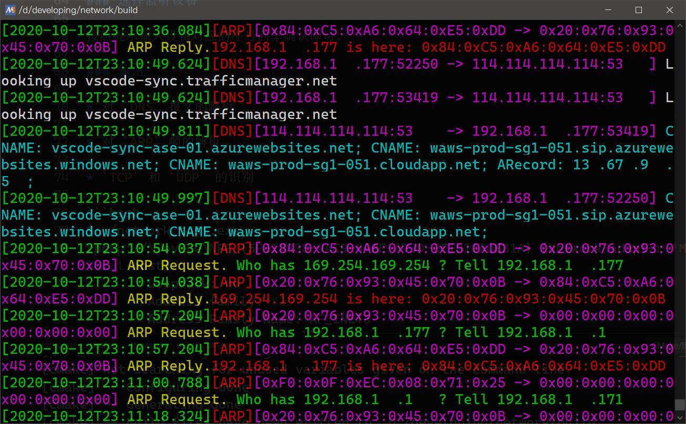

# Sniffle   
名字是创建仓库的时候 `Github` 给的建议, 不是拼写错误（x   
基于 `Npcap` [`Npcap`](https://npcap.org)。文档说这个比 `Winpcap`好，因为那个已经不再更新了……  

## 编译运行环境

* `MSYS2 + mingw-w64-cmake + mingw-w64-gcc-10.1.1`    
* 依赖 `npcap`. 请确保你[安装](https://npcap.org)了   
* （可选）错误信息打印依赖 `mingw-w64-x86_64-binutils`的 `addr2line`，已经放入 `Lib` 文件夹下   
* 其余需要的静态库已经放入 `Lib` 目录下
* 如果你不使用 `MSYS/MinGW Bash`，请先打开 `Windows 10` 对 `vt codes` 的支持。
> 在 `Powershell` 里执行：
> ```powershell
> Set-ItemProperty HKCU:\Console VirtualTerminalLevel -Type DWORD 1
> ```  


## 编译步骤

1. 克隆仓库  
```bash
$ git clone -o sniffle --recurse-submodules https://github.com/CORunEverywhere/Sniffle.git 
```
2. 创建文件夹
```bash
$ mkdir -p sniffle/build/ && cd $_
```
3. 确保你配置好了`CMAKE_CXX_COMPILER` 后，运行 `cmake`:
```bash
$ cmake ..
```
4. 运行 `make`:
```bash
$ make
``` 

## 目录结构 
```txt
├── Include             包含 `Npcap` 和 `sniffle` 所需要的所有头文件
│   └── pcap
├── Lib                 包含编译所需要的二进制文件
│   └── x64
├── src                 *.cc 实现
└── third_party         可能会用到的第三方库Orz
    ├── nano-signal-slot
    └── npcap
```  

## 使用方法

### 配置过滤器  

在运行目录下创建 `sniffle_config.ini`, 按照如下格式书写过滤规则。
`packet_filter` 接受一个字符串，请使用双引号引起字符串。  
规则语法请参见 `npcap` [开发文档](https://nmap.org/npcap/guide/wpcap/pcap-filter.html)
```ini
[sniffle]
; See https://nmap.org/npcap/guide/wpcap/pcap-filter.html for more information
packet_filter = "arp or dst port 53 or src port 53"
```  
默认的规则是全部的 `tcp` 和 `udp` 报文。  

### 选择监听设备

按照提示输入设备对应的序号回车确认即可。  

### 输出

* 对 `DNS` 报文的解析  
* 对 `ARP` 帧的解析  
* `TCP` 和 `UDP` 的识别  
   

