## WireWhare
#### 介绍

计算机网络大作业 - 基于 `Npcap` 的 `Windows` 简易流量分析工具。提供 `CLI` 和 `GUI` 两种版本。

`GUI` 前端部分采用 `C# .Net` 编写；`CLI` 后端部分采用 `C++`编写。后端部分的代码已经放在 `github` 上：[仓库地址](https://github.com/CORunEverywhere/Sniffle) 

基本结构如下

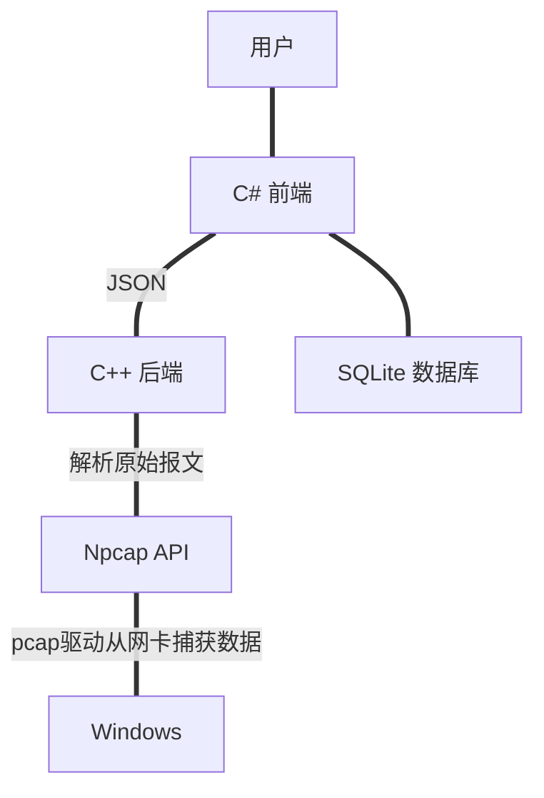

大力复读一下基本流程： `Npcap` 从网卡捕获到数据包后，传递给后端；后端拿到数据包从链路层往上逐层解析、解析结果经 `JSON` 格式化，传递给 前端。前端对这些数据进行统计、绘图；用户可以选择将结果保存到 `SQLite` 数据库。

#### 效果展示  

1. 用户需要选择需要监听的设备。

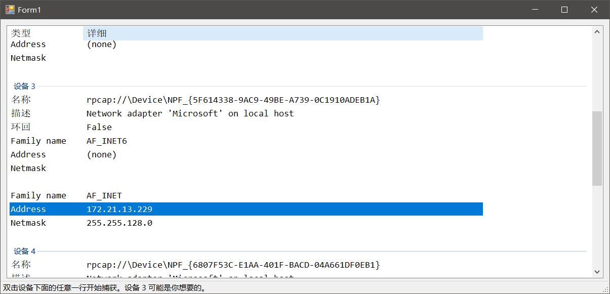

由于用户可能有多个（虚拟）网卡共存、因此我们做了一个判断：会提示用户可能想要的网卡（当然最终的决定权还是在用户的）

选择好后、双击即可。

2. 捕获页面

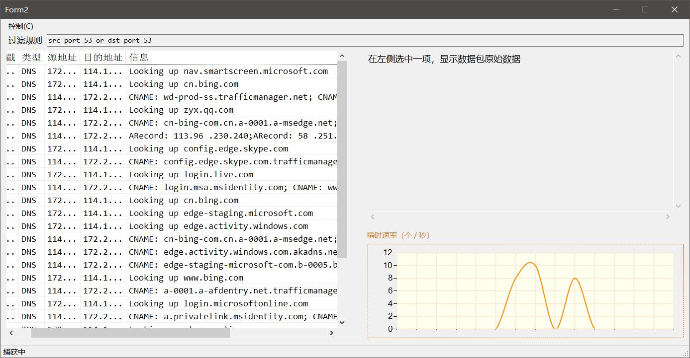

这里以捕获 `DNS` 报文为例。左侧显示的是已经捕获到的报文；右侧显示的是报文的原始数据、右下角显示的是捕获的瞬时速率情况。

用户可以随时暂停：

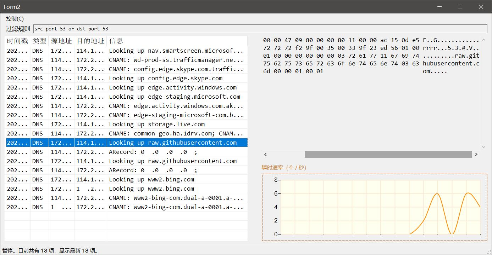

暂停后、用户可以更改捕获的规则。这里我们尝试捕获 `QQ` 的报文。由于 `QQ` 的通信协议是私有的、并且没有公开的文档。所以这里我们参考了 `Wireshark` 的实现。而 `Wireshark` 对于 `QQ` 的协议也是逆向得到的，因此并不能保证能够完整解析、不能保证这样的报文在任何环境下都能被稳定捕获。

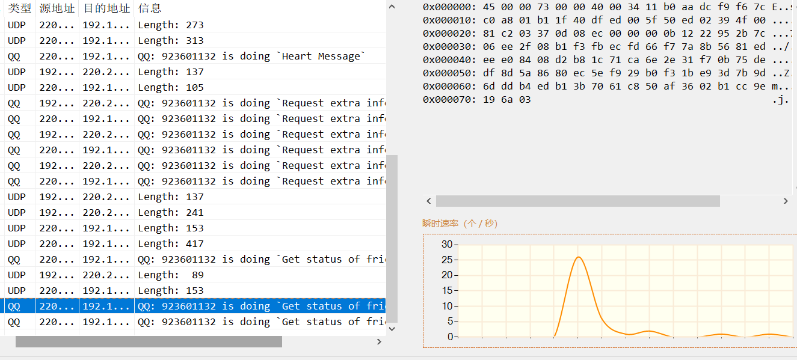

（如图，可以捕获到 `QQ` 号）

在图书馆的公共无线局域网中捕获 `ARP` 报文。
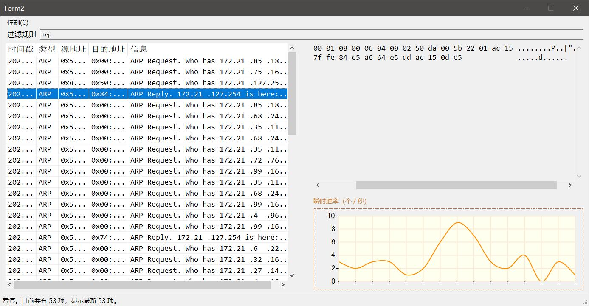

3. 导入导出

用户可以选择暂停后导出捕获的数据包。

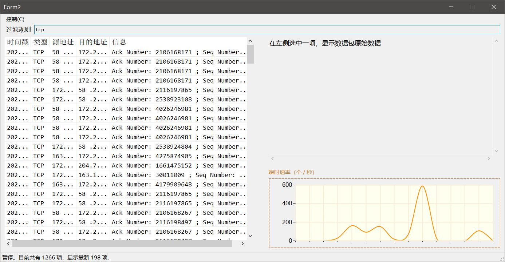

我们捕获 `TCP` 协议的报文、之后试着导出。这里针对较大的数据做了优化、只显示最新的报文。用户选择 `控制 -> 导出数据` 

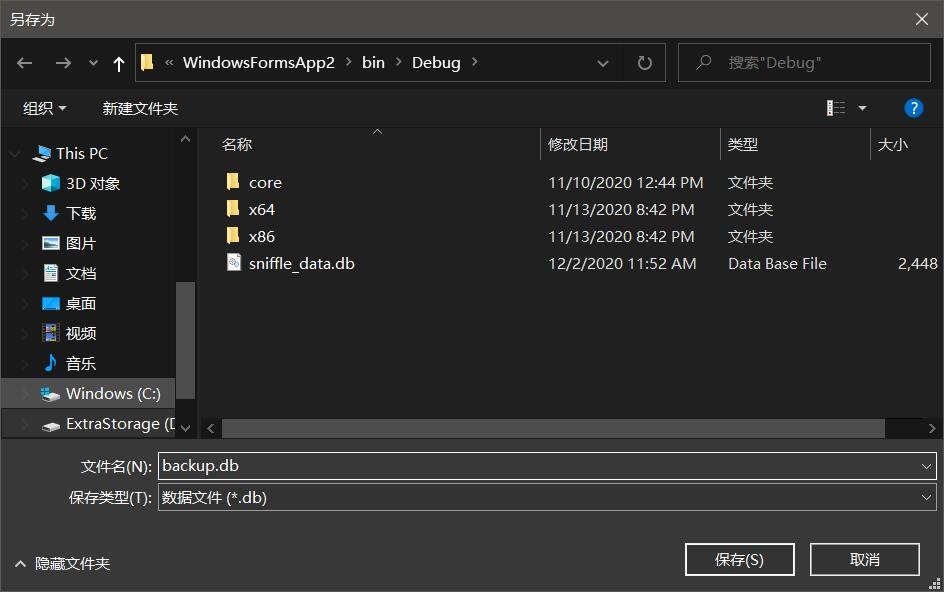

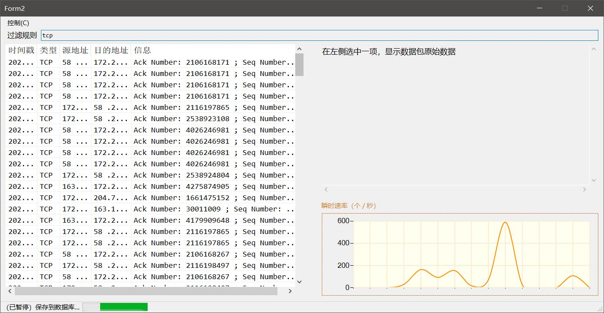

 用户也可以选择导入之前的数据：

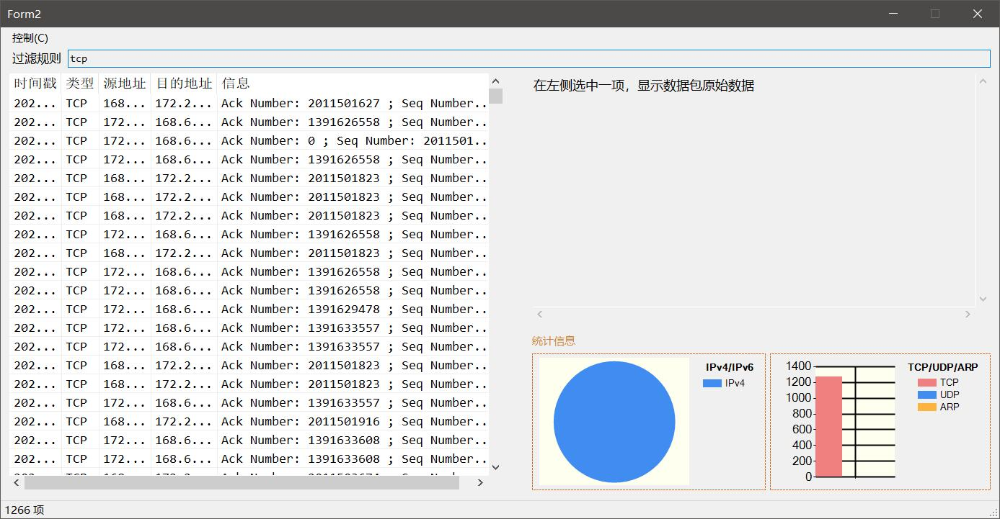

导入后、右下角会显示数据的总体分布情况。其中 `IPv4/6`的分布采用饼形图展示、`TCP/UDP/ARP` 采用条形图展示。

由于图书馆的无线局域网不支持`IPv6`，所以这里没有捕获到 `v6` 的报文。这张图片是在宿舍的个人路由器(`Openwrt`) 环境下捕获的：

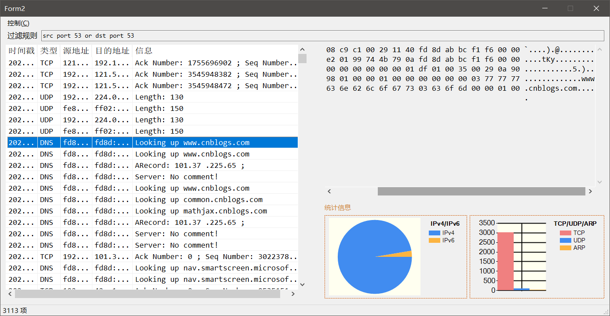

4. 针对较大流量的优化

考虑到捕获流量的时候如果数据包过多、因此内存的使用是相当大的。很多没必要同时展示的部分我们考虑把它放到硬盘中。这样也加快了未来的保存速度。我们暂且钦定如果数据超过 $1000$ 条、同时当前的瞬时流量没有那么高的情形下，程序自动把最早捕获的 $800$ 条内容放到数据库中。

```c#
const int take = 800;
if (data_listViews.Count > 1000 && tot < 10) {
    await Task.Run(() => {

        lock_db.WaitOne();

        var copy_raw = new List<string>(data_Raw.Take(take));
        var copy_data = new List<ListViewItem>(data_listViews.Take(take));

        var Path = System.IO.Path.GetDirectoryName(System.Reflection.Assembly.GetExecutingAssembly().Location);
        doExportDB(ref copy_raw, ref copy_data, Path + "\\sniffle_data.db", false);

        copy_data.Clear();
        copy_raw.Clear();
        copy_raw.Capacity = copy_raw.Capacity = 0;

        listView1.Invoke((Action)delegate {
            if (listView1.VirtualListSize >= data_Raw.Count)
                listView1.VirtualListSize -= take;
        });

        lock (data_Raw) {
            data_Raw.RemoveRange(0, take);
            data_listViews.RemoveRange(0, take);
            data_listViews.Capacity -= take;
            data_Raw.Capacity -= take;
        }
        GC.Collect();
        lock_db.ReleaseMutex();

});
```

我们来测试一下手动缓存后、内存的使用情况。测试选择捕获最常见的 `TCP` 流量。浏览 `Bilibili` 时，经过测试，在一分钟以内，可以捕获到约 $3000$ 条数据。

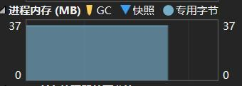

起始时，消耗内存约 $37$ MB（包括虚拟内存占用）。我们在打开一个视频后，内存占用飙升至 $144$ MB 左右。在流量进行的不是特别大的时候，缓存条件被触发。

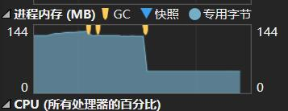

此时内存占用由 $144$ M 跌至 $44$ M, 其余大部分的数据都被我们放入了数据库。
当然，把这些数据保存后重新打开，看一下如果不做手动缓存的话的内存占用。

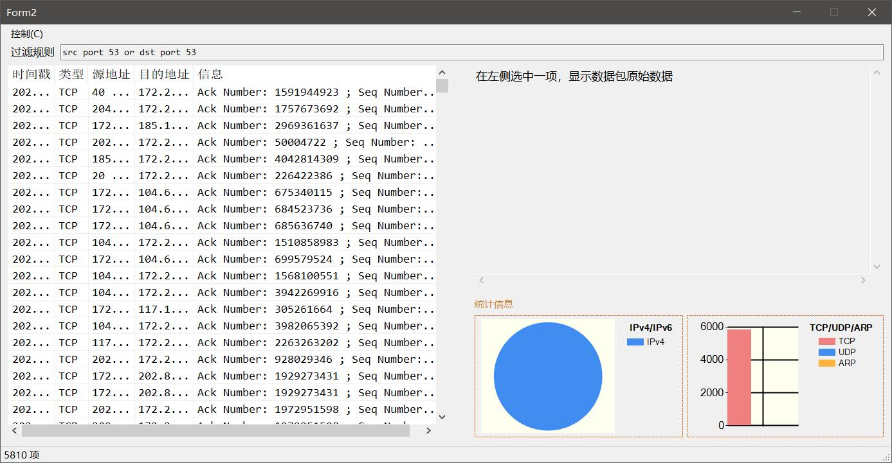

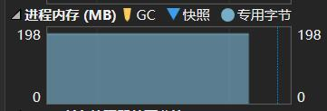

相比于之前，我们的内存占用是没有优化的 $\dfrac{44}{198} = 22 \%$。

当然，这样的方法也有一些不足之处。 因为时间关系，我们没有实现动态流量下的自动调整回收的阈值，因此从这个角度上来讲，这样的方法并不是最优的。

另一方面，我们对原始数据用 `gZip` 压缩算法进行压缩。存入数据库的原始数据部分是压缩后的字符串。这样，$9510$ 条数据（含原始数据、解析数据）共占用运行内存 $87$ M 左右；导出的数据占用约 $60$ M 左右。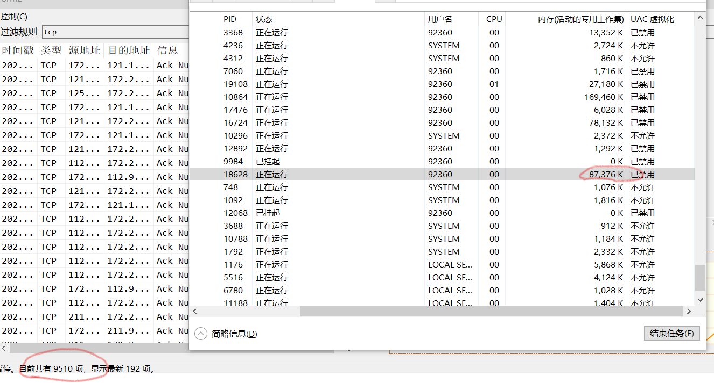

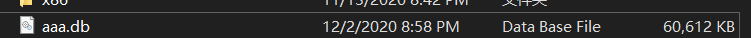
